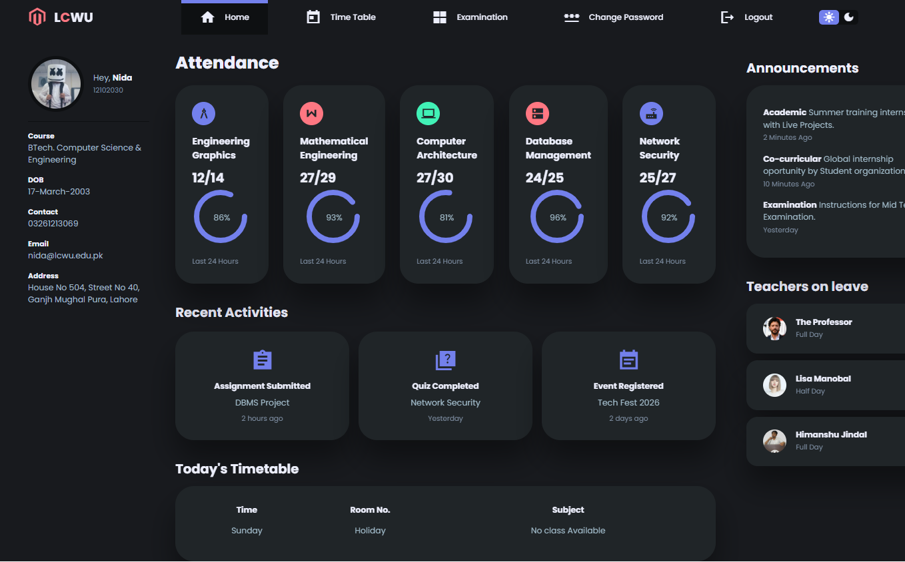
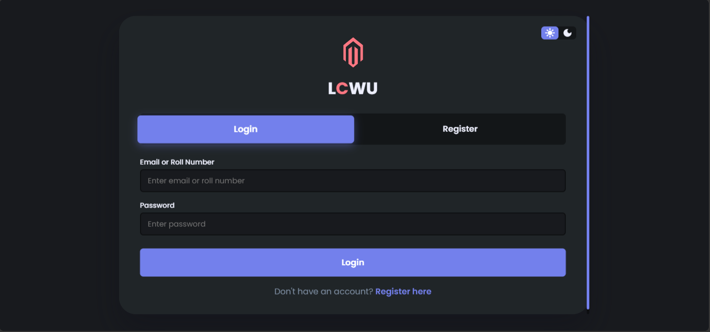
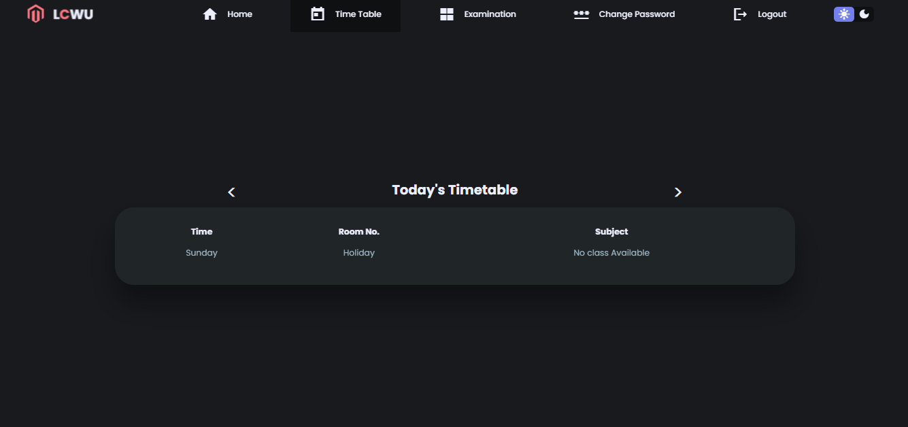
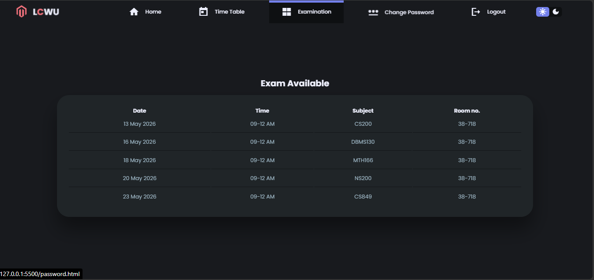
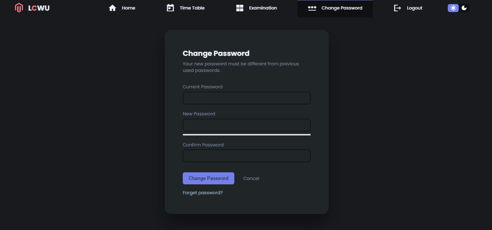

# 🎓 LCWU Student Dashboard

> A complete student management system with authentication, dynamic timetable, dark/light theme, and stunning 3D animations.



---

## 📋 Table of Contents
- [Live Demo](#-live-demo)
- [Features](#-features)
- [Screenshots](#-screenshots)
- [Tech Stack](#-tech-stack)
- [Installation](#-installation)
- [Default Login Credentials](#-default-login-credentials)
- [Usage](#-usage)
- [Project Structure](#-project-structure)
- [Author](#-author)

---

## 🌐 Live Demo

**[View Live Demo](https://nida-coder.github.io/decodelabs_tasks/)**

> Click the link above to see the live version of this project!

---

## ✨ Features

### 🔐 Authentication System
- **Login**: Email or Roll Number based login
- **Register**: Complete registration with all details
- **Profile Picture**: Upload profile image
- **Password Change**: Secure password update
- **Session Management**: LocalStorage based

### 📊 Dashboard
- **Attendance Tracking**: Visual progress circles
- **Dynamic Timetable**: Day navigation with prev/next
- **Recent Activities**: Quick updates
- **Announcements**: Important notices
- **Teacher Leave**: Staff availability

### 🌗 Theme Support
- **Light/Dark Mode**: Toggle with 1 click
- **Persistent**: Saved in LocalStorage
- **Smooth Transitions**: No flash on page change

### 📱 Responsive Design
- **Mobile-First**: Optimized for all devices
- **Tablet Support**: 768px and up
- **Desktop Optimized**: 1024px and up
- **Clamp() Typography**: Auto-adjusting fonts

### 🎨 3D Animations
- **Card Hover Effects**: 3D rotation
- **Floating Elements**: Smooth animations
- **Logo Spin**: 360° rotation
- **Progress Animations**: Interactive circles

---

## 📸 Screenshots

### 🏠 Dashboard


### 🔐 Login Page


### 📅 Timetable View


### 📋 Exam Schedule


### 🔑 Password Change


### 🌙 Dark Theme


---

## 🛠️ Tech Stack

| Technology | Purpose |
|------------|---------|
|  | Semantic Structure |
|  | Styling & Animations |
|  | Functionality |
|  | Data Persistence |
|  | Typography |

---

## 🚀 Installation

### 1. Clone the Repository
```bash
git clone https://github.com/nida-coder/decodelabs_tasks.git
cd decodelabs_tasks
```

### 2. Open in Browser
Simply open `index.html` in your preferred browser.

### 3. Or Use Live Server (VS Code)
- Install Live Server extension
- Right-click on `index.html`
- Select "Open with Live Server"

---

## 🔑 Default Login Credentials

### Pre-Configured Accounts

| # | Name | Roll Number | Email | Password |
|---|------|-------------|-------|----------|
| 1 | **Nida** | `12102030` | `nida@lcwu.edu.pk` | `nida123` |
| 2 | **Alex** | `12102031` | `alex@lcwu.edu.pk` | `alex123` |

### Quick Login Options
- Use **Email**: `nida@lcwu.edu.pk` OR
- Use **Roll Number**: `12102030`
- **Password**: `nida123`

> 💡 You can also register your own account with any email and password!

---

## 💻 Usage

### Login
1. Enter your Email or Roll Number
2. Enter your Password
3. Click "Login" or press Enter

### Register
1. Click the "Register" tab
2. Fill all required fields:
   - Full Name
   - Roll Number
   - Email
   - Course
   - Date of Birth
   - Contact Number
   - Address
   - Password (min 6 characters)
3. Upload profile picture (optional)
4. Click "Create Account"
5. Login with your new credentials

### Dashboard
- View attendance progress with animated circles
- Check daily timetable
- Read announcements
- See teachers on leave

### Theme Toggle
- Click the sun/moon icon in the header
- Theme preference is saved automatically
- Works across all pages

### Timetable Navigation
- Click `<` for previous day
- Click `>` for next day
- Click `X` to close full view

### Change Password
1. Go to "Change Password" page
2. Enter current password
3. Enter new password (min 6 characters)
4. Confirm new password
5. Click "Change Password"

### Logout
- Click "Logout" in the navigation
- Confirm logout
- Redirected to login page

---

## 📁 Project Structure

```
decodelabs_tasks/
│
├── 📂 images/                  # Screenshots
│   ├── dashboard.png
│   ├── login.png
│   ├── register.png
│   ├── timetable.png
│   ├── exam.png
│   ├── password.png
│   ├── dark-theme.png
│   └── mobile.png
│
├── 📄 index.html              # Main Dashboard
├── 📄 login.html              # Login/Register Page
├── 📄 timetable.html          # Timetable Page
├── 📄 exam.html               # Exam Schedule
├── 📄 password.html           # Password Change
│
├── 🎨 style.css               # Global Styles
├── 📜 app.js                  # Main JavaScript
├── 📜 timeTable.js            # Timetable Data
│
└── 📖 README.md              # Documentation
```

---

## 🎯 Key Features Explained

### Semantic HTML5
- `<header>` & `<nav>` for navigation
- `<main>` for main content
- `<section>` for content sections
- `<article>` for individual items
- `<footer>` for footer content
- ARIA labels for accessibility

### CSS Grid & Flexbox
- **Grid**: Page layout structure
- **Flexbox**: Component alignment
- **Clamp()**: Responsive typography

### Mobile-First Strategy
1. Mobile: Single column
2. Tablet: 2 columns
3. Desktop: 3 columns

### JavaScript Features
- **LocalStorage**: User data, theme, session
- **Event Listeners**: Interactive elements
- **DOM Manipulation**: Dynamic content
- **Form Validation**: Input validation

---

## 🔧 Customization

### Change Colors
Edit `style.css`:
```css
:root {
    --color-primary: #7380ec;     /* Change primary color */
    --color-danger: #ff7782;      /* Change danger color */
    --color-success: #41f1b6;     /* Change success color */
}
```

### Change Timetable Data
Edit `timeTable.js`:
```javascript
const Monday = [
    {   
        time: '09-10 AM',
        roomNumber: '38-718',
        subject: 'DBMS130',
        type: 'Lecture'
    }
]
```

### Add New Users
Edit in `login.html` JavaScript:
```javascript
const defaultUsers = [
    {
        name: 'Your Name',
        rollNumber: '12345678',
        email: 'your@email.com',
        password: 'yourpassword'
    }
]
```

---

## 👩‍💻 Author

**Nida** - Student Developer

- 📧 Email: nidasajjad120@gmail.com
- 🎓 Institution: LCWU (Lahore College for Women University)
- 📱 Contact: 03261213069

---

## 📄 License

This project is created for **Decodelabs Internship Program**.

---

## 🙏 Acknowledgments

- **Decodelabs** for this opportunity
- **LCWU** for education
- All contributors and testers

---

## 📊 Project Status


---

## ⚡ Quick Links

| Link | Purpose |
|------|---------|
| [Live Demo](https://nida-coder.github.io/decodelabs_tasks/) | View Live Project |
| [GitHub Repository](https://github.com/nida-coder/decodelabs_tasks) | Source Code |
| [Contact Author](mailto:nidasajjad120@gmail.com) | Email |

---

**Made with ❤️ for Decodelabs Internship**

⭐ Don't forget to star this repository if you found it helpful!
